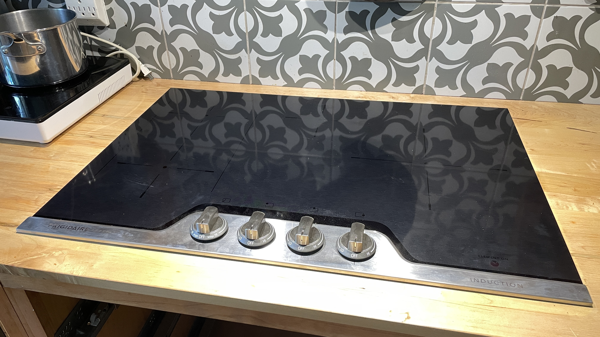
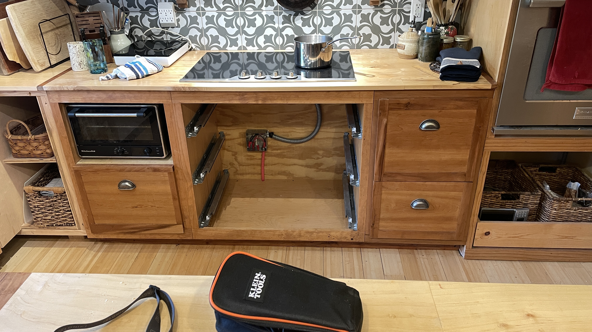

#### Frigidaire Professional FPIC3077RF Inductive Cooktop

This document created/revised April 5, 2026

- 30 inch, ADA Compliant Induction Cooktop
- 4 Elements 
- PowerPlus Induction Technology 
- SpacePro Bridge Element
- Knob Controls
- Stainless Steel (front trim and knobs)

Wiring is 4 wire, 220 volt, 2 hot, 1 neutral, 1 ground. Cable from the cooktop is metal clad, 1 1/4 diameter. Junction boxes with 1 1/4 knockouts are not common in home centers. Wire clamps/hubs for 1 1/4 are also not common.

Miniumum current draw: 0 amps measured with a Klein amp clamp. Zero on both hot wires and on the neutral, so
it really is zero. My guess is that the knob control needs zero current draw. Knob controls are simpler.

Other units with touch countrols require some current for the microcontroller that senses the touch panel.

There are two cooling fans. The fans are temperature sensing and only runs when required.

As of April 5, 2026, the Frigidaire FPIC3077RF is listed as "Out of Stock". I purchased this new unit from Amazon via a third party reseller for $680. Frigidaire retail $2,499. I suspect this unit will soon be discontinued. I also expect Frigidaire to carry parts for many years in the future. Remember, even if you buy a currently-produced unit, in a few years it will also be discontinued. Buy a brand/manufacturer that will continue to carry parts for many years (or basically forever).

#### Manufacturer's page

[Frigidaire FPIC3077R official page](https://www.frigidaire.com/en/p/kitchen/cooktops/induction-cooktops/FPIC3077RF)
{:target="_blank"}

#### Photos

